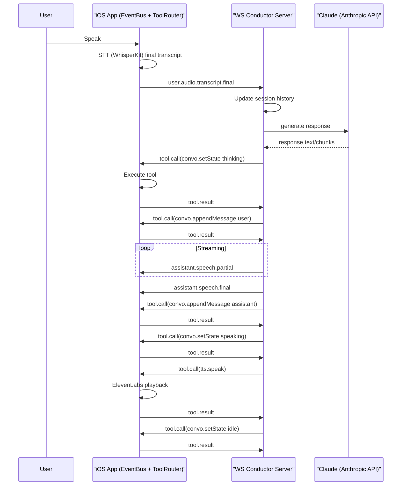

# Abyss Phase 2 Architecture

## Overview

Phase 2 replaces the local-only conductor path with a real WebSocket conductor service.

- iOS remains the only executor of client tools (`stt.*`, `tts.*`, `convo.*`).
- Backend drives behavior by emitting `tool.call` and `assistant.speech.*` events.
- iOS executes `tool.call` via `ToolRouter` and sends `tool.result` back to the backend.
- Local barge-in remains immediate and local-first (`tts.stop` before `stt.start`).

## Sequence

## Tool Responsibility Boundary

Client tools (executed only on iOS):

- `stt.start`, `stt.stop`
- `tts.speak`, `tts.stop`
- `convo.appendMessage`, `convo.setState`

Server responsibilities:

- Decide event/tool sequence
- Emit `assistant.speech.partial/final`
- Emit `tool.call` in ordered steps
- Accept and log `tool.result`
- Maintain session memory + pending tool calls

## Provider Abstraction

Server provider interface:

- `ModelProvider.generateResponse(conversation) -> { fullText, chunks }`

Implementations:

- `AnthropicProvider` (active): uses `ANTHROPIC_API_KEY` and Claude model config
- `BedrockNovaProvider` (scaffold): placeholder for later cutover

Switching providers is config-only:

- `MODEL_PROVIDER=anthropic` (current)
- `MODEL_PROVIDER=bedrock` (future)

This keeps Bedrock re-entry low-risk once rate limits are resolved.
