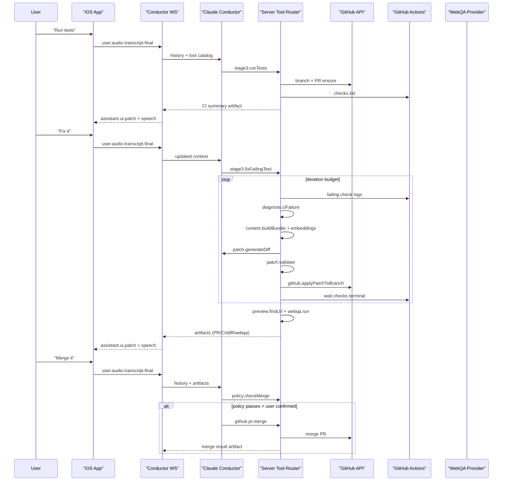

# Stage 3 Architecture

## Overview

Stage 3 keeps formal tool calling as the control plane:

- Conductor (LLM) decides actions by calling tools.
- iOS executes only client tools (`stt.*`, `tts.*`, `convo.*`, optional `agent.*`).
- Backend executes only server tools (`github.*`, `ci.*`, `embeddings.*`, `context.*`, `patch.*`, `webqa.*`, `policy.*`, `runner.*`).

## End-to-end sequence

## Module boundaries

- `server/src/core/*`: transport, sessions, conductor loop, protocol events.
- `server/src/stage3/tools/*`: typed server/client tool registry + execution routing.
- `server/src/stage3/github/*`: GitHub PR-first integration.
- `server/src/stage3/ci/*`: CI checks/logs + failure diagnosis.
- `server/src/stage3/embeddings/*`: repo indexing + semantic query.
- `server/src/stage3/context/*`: hybrid context bundle builder.
- `server/src/stage3/patch/*`: unified diff generation/validation/apply.
- `server/src/stage3/preview/*`: preview URL discovery.
- `server/src/stage3/webqa/*`: provider-swappable web validation.
- `server/src/stage3/policy/*`: merge gating.
- `server/src/stage3/runner/*`: hosted runner interface (stub now).

## Provider swap points

- Conductor model provider: `server/src/providers/*` (Anthropic now, Bedrock scaffold retained).
- Patch generation provider: `PatchGenerationProvider`.
- Embeddings provider: `EmbeddingsProvider`.
- WebQA provider: `WebQAProvider`.
- Runner provider: `RunnerProvider`.
